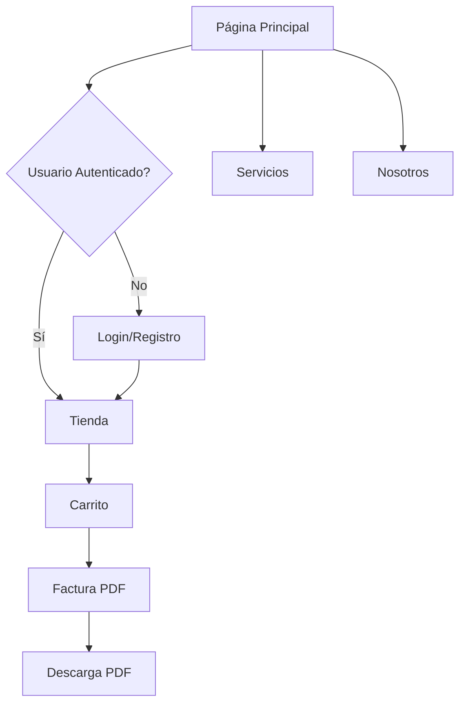

## 1. Product Overview
Página web profesional y totalmente responsive para Integra Tech - empresa de sistemas y soporte técnico. La plataforma ofrece servicios de capacitación TIC, análisis de datos, reparación de hardware/software y una tienda en línea de suministros informáticos.

La solución permite a los usuarios registrarse, acceder a servicios profesionales, comprar productos tecnológicos y generar facturas PDF, facilitando la gestión integral de necesidades tecnológicas para empresas y particulares.

## 2. Core Features

### 2.1 User Roles
| Role | Registration Method | Core Permissions |
|------|---------------------|------------------|
| Usuario Regular | Registro por email | Navegar productos, comprar, generar facturas |
| Usuario Autenticado | Login con credenciales | Acceso completo a tienda, historial de compras, gestión de cuenta |

### 2.2 Feature Module
La plataforma Integra Tech consta de las siguientes páginas principales:

1. **Página Principal**: Hero section, navegación, presentación de servicios, productos destacados.
2. **Iniciar Sesión**: Formulario de autenticación para usuarios registrados.
3. **Registro**: Formulario de creación de cuenta con validación de datos.
4. **Nosotros**: Información de la empresa, misión, visión, equipo.
5. **Servicios**: Capacitación TIC, Análisis de Datos, Reparación Hardware/Software.
6. **Tienda**: Catálogo de productos, filtros por categoría, búsqueda avanzada.
7. **Carrito de Compras**: Gestión de productos seleccionados, cálculo de totales.
8. **Factura PDF**: Generación y descarga de factura en formato PDF.

### 2.3 Page Details
| Page Name | Module Name | Feature description |
|-----------|-------------|---------------------|
| Página Principal | Hero Section | Presentación visual con animaciones, logo de empresa, mensaje de bienvenida profesional. |
| Página Principal | Navegación | Menú responsive con enlaces a todas las secciones, botones de login/registro. |
| Página Principal | Servicios Destacados | Cards visuales mostrando capacitación TIC, análisis datos, reparaciones con íconos profesionales. |
| Página Principal | Productos Destacados | Carrusel de productos principales con precios y botón "Ver más". |
| Iniciar Sesión | Formulario Login | Campos email/contraseña con validación, opción "Recordarme", enlace a registro. |
| Registro | Formulario Registro | Campos nombre completo, email, contraseña, confirmación contraseña, validación en tiempo real. |
| Nosotros | Información Empresa | Texto descriptivo sobre misión, visión, valores con diseño profesional en cards. |
| Nosotros | Equipo | Sección con perfiles de personal técnico cualificado. |
| Servicios | Capacitación TIC | Descripción de cursos, duración, modalidades, beneficios. |
| Servicios | Análisis de Datos | Explicación de servicios de análisis, herramientas utilizadas, casos de éxito. |
| Servicios | Reparación Hardware/Software | Lista de servicios de mantenimiento, diagnóstico, actualización de equipos. |
| Tienda | Catálogo Productos | Grid de productos con imagen, nombre, precio, disponibilidad, botón agregar al carrito. |
| Tienda | Filtros y Búsqueda | Filtros por categoría (periféricos, suministros), barra de búsqueda con autocompletado. |
| Carrito de Compras | Lista Productos | Tabla con productos seleccionados, cantidad editable, precio unitario y total. |
| Carrito de Compras | Resumen Compra | Cálculo de subtotal, impuestos, total general, botón proceder a factura. |
| Factura PDF | Generación Factura | Formulario con datos del comprador, lista de productos, cálculos automáticos. |
| Factura PDF | Descarga PDF | Botón para descargar factura en PDF con logo de empresa, datos fiscales completos. |

## 3. Core Process
### Flujo de Usuario Regular:
1. Usuario llega a página principal → Navega servicios y productos → Decide registrarse → Completa formulario → Accede a tienda completa → Agrega productos al carrito → Genera factura PDF → Descarga documento.

### Flujo de Compra:
1. Usuario autenticado → Navega tienda → Filtra productos → Agrega al carrito → Revisa carrito → Procede a factura → Ingresa datos → Genera PDF → Descarga factura.

## 4. User Interface Design

### 4.1 Design Style
- **Colores Primarios**: Azul oscuro (#1e3a8a) y azul medio (#3b82f6) basados en el logo
- **Colores Secundarios**: Gris oscuro (#374151) y gris claro (#9ca3af)
- **Estilo de Botones**: Bordes redondeados (8px), efecto hover con sombra sutil
- **Tipografía**: Fuente sans-serif moderna (Inter o similar), tamaños: 16px cuerpo, 24px títulos
- **Estilo de Layout**: Basado en cards con espaciado generoso, navegación sticky en desktop
- **Iconos**: Estilo lineal profesional, colores consistentes con paleta principal

### 4.2 Page Design Overview
| Page Name | Module Name | UI Elements |
|-----------|-------------|-------------|
| Página Principal | Hero Section | Background gradient azul-gris, logo centrado, texto "Bienvenido a Integra Tech" en blanco, animación suave de entrada. |
| Página Principal | Navegación | Barra superior sticky, logo a la izquierda, menú centrado, botones login/registro a la derecha, responsive hamburger menu. |
| Página Principal | Servicios Destacados | Grid 3 columnas en desktop, cards con iconos circulares azules, títulos en gris oscuro, descripciones breves. |
| Tienda | Catálogo Productos | Grid responsive 4 columnas desktop/2 tablet/1 móvil, cards con imagen 16:9, precio destacado en azul, badge disponibilidad verde. |
| Carrito de Compras | Lista Productos | Tabla con bordes sutiles, filas alternadas gris muy claro, botones cantidad circulares, icono eliminar rojo. |
| Factura PDF | Formulario | Campos con labels arriba, bordes grises focus azul, validación visual con bordes rojos en error, botón generar azul primario. |

### 4.3 Responsiveness
- **Diseño Desktop-First**: Optimizado para pantallas grandes (1440px+)
- **Breakpoints**: 1024px (tablet), 768px (móvil grande), 375px (móvil pequeño)
- **Adaptación Mobile**: Menú hamburger, cards apiladas verticalmente, formularios full-width
- **Optimización Touch**: Botones mínimo 44px, espaci