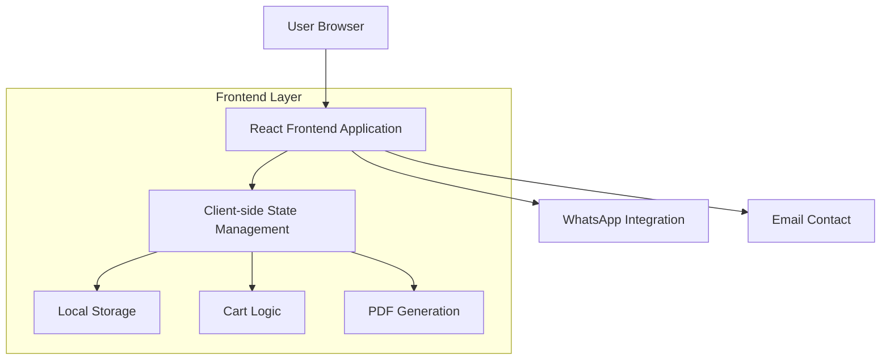

## 1. Architecture design



## 2. Technology Description
- **Frontend**: React@18 + tailwindcss@3 + vite
- **Initialization Tool**: vite-init
- **State Management**: React Context API + useReducer
- **PDF Generation**: jspdf + html2canvas
- **Icons**: lucide-react
- **Form Validation**: react-hook-form + yup
- **Backend**: None (client-side implementation)

## 3. Route definitions
| Route | Purpose |
|-------|---------|
| / | Página principal con hero section y servicios destacados |
| /login | Formulario de autenticación de usuarios |
| /register | Formulario de registro de nuevos usuarios |
| /nosotros | Información sobre la empresa y equipo |
| /servicios | Página de servicios (capacitación, análisis, reparación) |
| /tienda | Catálogo de productos con filtros y búsqueda |
| /carrito | Gestión de productos seleccionados para compra |
| /factura | Generación y descarga de factura PDF |

## 4. Component Architecture

### 4.1 Core Components Structure
```
src/
├── components/
│   ├── layout/
│   │   ├── Header.jsx
│   │   ├── Footer.jsx
│   │   └── Navigation.jsx
│   ├── home/
│   │   ├── HeroSection.jsx
│   │   ├── ServicesPreview.jsx
│   │   └── FeaturedProducts.jsx
│   ├── auth/
│   │   ├── LoginForm.jsx
│   │   └── RegisterForm.jsx
│   ├── services/
│   │   ├── ServiceCard.jsx
│   │   └── ServicesList.jsx
│   ├── store/
│   │   ├── ProductGrid.jsx
│   │   ├── ProductCard.jsx
│   │   ├── ProductFilters.jsx
│   │   └── SearchBar.jsx
│   ├── cart/
│   │   ├── CartItem.jsx
│   │   ├── CartSummary.jsx
│   │   └── CartActions.jsx
│   └── invoice/
│       ├── InvoiceForm.jsx
│       └── InvoicePDF.jsx
├── contexts/
│   ├── AuthContext.jsx
│   ├── CartContext.jsx
│   └── ThemeContext.jsx
├── hooks/
│   ├── useLocalStorage.js
│   ├── useCart.js
│   └── useAuth.js
├── utils/
│   ├── pdfGenerator.js
│   ├── validators.js
│   └── formatters.js
└── data/
    ├── products.js
    └── services.js
```

### 4.2 State Management
- **AuthContext**: Gestión de estado de autenticación del usuario
- **CartContext**: Gestión del carrito de compras con persistencia en localStorage
- **ThemeContext**: Control del tema y modo oscuro

## 5. Data Models

### 5.1 Product Model
```javascript
const Product = {
  id: string,
  name: string,
  description: string,
  price: number,
  category: string, // 'perifericos' | 'suministros' | 'hardware' | 'software'
  stock: number,
  image: string,
  specifications: object,
  isActive: boolean
}
```

### 5.2 Cart Item Model
```javascript
const CartItem = {
  productId: string,
  quantity: number,
  price: number,
  addedAt: Date
}
```

### 5.3 User Model (Local Storage)
```javascript
const User = {
  id: string,
  email: string,
  name: string,
  isAuthenticated: boolean,
  createdAt: Date
}
```

### 5.4 Invoice Model
```javascript
const Invoice = {
  id: string,
  userId: string,
  items: CartItem[],
  subtotal: number,
  tax: number,
  total: number,
  customerInfo: {
    name: string,
    email: string,
    phone: string,
    address: string
  },
  createdAt: Date,
  invoiceNumber: string
}
```

## 6. Local Storage Schema

### 6.1 User Authentication
```javascript
// localStorage key: 'integra-tech-user'
{
  "id": "user-123",
  "email": "usuario@email.com",
  "name": "Juan Pérez",
  "isAuthenticated": true,
  "createdAt": "2024-01-15T10:30:00Z"
}
```

### 6.2 Shopping Cart
```javascript
// localStorage key: 'integra-tech-cart'
{
  "items": [
    {
      "productId": "prod-001",
      "quantity": 2,
      "price": 150000,
      "addedAt": "2024-01-15T10:35:00Z"
    }
  ],
  "lastUpdated": "2024-01-15T10:35:00Z"
}
```

### 6.3 Invoice History
```javascript
// localStorage key: 'integra-tech-invoices'
[
  {
    "id": "inv-001",
    "invoiceNumber": "INT-2024-001",
    "createdAt": "2024-01-15T11:00:00Z",
    "total": 315000,
    "itemsCount": 2
  }
]
```

## 7. PDF Generation Implementation

### 7.1 Invoice Template Structure
- **Header**: Logo de Integra Tech, datos de la empresa
- **Customer Info**: Datos del comprador ingresados en el formulario
- **Items Table**: Lista de productos con cantidad, precio unitario, total
- **Totals Section**: Subtotal, impuestos (19%), total general
- **Footer**: Información de contacto, agradecimiento

### 7.2 PDF Styling
- **Fonts**: Arial para contenido, negrita para headers
- **Colors**: Azul corporativo (#1e3a8a) para headers, gris para bordes
- **Layout**: Márgenes de 20mm, espaciado consistente
- **Page Size**: A4 estándar

## 8. Responsive Design Implementation

### 8.1 Breakpoints
```css
/* Tailwind CSS breakpoints */
/* sm: 640px */
/* md: 768px */
/* lg: 1024px */
/* xl: 1280px */
/* 2xl: 1536px */
```

### 8.2 Mobile-First Approach
- **Base**: Diseño para móviles (375px+)
- **Tablet**: Adaptación para 768px+
- **Desktop**: Layout completo para 1024px+

## 9. Contact Integration

### 9.1 WhatsApp Integration
```javascript
// WhatsApp API link structure
`https://wa.me/573227579082?text=${encodedMessage}`
```

### 9.2 Email Contact
```javascript
// Email integration
`mailto:integra.tech.sis@gmail.com?subject=${subject}&body=${body}`
```

## 10. Performance Optimization

### 10.1 Code Splitting
- Lazy loading para rutas de tienda y factura
- Componentes cargados bajo demanda

### 10.2 Image Optimization
- Imágenes de productos en WebP cuando sea posible
- Lazy loading para imágenes fuera de viewport
- Tamaños de imagen optimizados para diferentes dispositivos

### 10.3 Local Storage Management
- Límite de 5MB para datos del carrito
- Limpieza automática de datos expirados
- Compresión de datos grandes cuando sea necesario